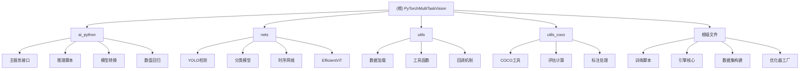

# PyTorchMultiTaskVision - AI 上下文文档

## 变更记录 (Changelog)

### 2025-10-13 03:01:09
- 初始化项目 AI 上下文文档
- 生成模块级文档和导航结构
- 添加 Mermaid 结构图和面包屑导航

## 项目愿景

PyTorchMultiTaskVision 是一个基于 PyTorch 的多任务视觉深度学习框架，专注于提供统一的图像分类、目标检测和数值回归解决方案。项目设计目标是简化深度学习模型训练、推理和部署流程，为研究者开发者提供高效、易用的视觉 AI 工具。

## 架构总览

### 核心特性
- **多任务支持**：图像分类、目标检测、数值回归
- **模块化设计**：训练、推理、数据清理、模型转换独立模块
- **分布式训练**：支持多 GPU 和集群训练
- **模型生态**：集成主流预训练模型（ConvNeXtV2、EfficientViT 等）
- **生产就绪**：FastAPI 服务接口、模型量化、ONNX/TensorRT 转换

### 技术栈
- **深度学习框架**：PyTorch + timm
- **数据处理**：torchvision、COCO API
- **优化器**：支持 Adam、AdamW、Lion、SGD 等
- **训练策略**：EMA、混合精度训练、余弦学习率调度
- **服务框架**：FastAPI + uvicorn
- **监控日志**：TensorBoard、Weights & Biases

## ✨ 模块结构图



## 模块索引

| 模块路径 | 职责描述 | 主要语言 | 关键文件 |
|---------|---------|---------|---------|
| `ai_python/` | AI 服务与推理模块 | Python | `main.py`, `predict_*.py`, `modelchange.py` |
| `nets/` | 神经网络模型定义 | Python | `yolo.py`, `convnext_v2.py`, `timesnet.py` |
| `utils/` | 通用工具与数据处理 | Python | `utils.py`, `dataloader.py`, `callbacks.py` |
| `utils_coco/` | COCO 数据集专用工具 | Python | `coco_annotation.py`, `coco_evaluation.py` |
| 根目录 | 训练脚本与核心引擎 | Python | `train_*.py`, `engine.py`, `datasets.py` |

## 运行与开发

### 快速开始
```bash
# 分类任务训练
python train_cls.py --data-path ./data --model convnextv2_tiny

# 目标检测训练
python train_det.py --data-path ./coco_data --backbone efficientvit_b0

# 启动 AI 服务
cd ai_python && python main.py
```

### 分布式训练
```bash
# 多 GPU 训练
torchrun --nproc_per_node=8 train_cls.py

# 集群训练
python run_with_submitit.py
```

## 测试策略

### 训练模式
- **train**: 完整训练流程，支持断点续训
- **eval**: 模型评估与验证
- **move**: 图片分类移动（空/非空检测）

### 评估指标
- **分类**: Top-1 准确率、精确率、召回率
- **检测**: mAP（平均精度均值）
- **数值回归**: MSE、MAE、R² 分数

### 数据验证
- COCO 数据集格式验证
- 图像标注完整性检查
- 类别分布均衡性分析

## 编码规范

### 代码组织
- 函数职责单一，避免过长函数
- 使用类型提示增强代码可读性
- 模块化导入，避免循环依赖
- 配置参数集中管理

### 命名规范
- 类名使用 PascalCase
- 函数和变量使用 snake_case
- 常量使用 UPPER_CASE
- 私有成员前缀单下划线

### 注释规范
- 关键函数添加文档字符串
- 复杂算法添加行内注释
- 模块级说明文件头部注释
- TODO 标记待完善功能

## AI 使用指引

### 模型选择指南
- **轻量级场景**: EfficientViT、ConvNeXtV2-Atto
- **高精度场景**: ConvNeXtV2-Base、Large
- **实时检测**: YOLO + EfficientViT 组合
- **科研实验**: 支持自定义模型集成

### 训练策略
- **小数据集**: 使用数据增强、迁移学习
- **大数据集**: 分层采样、分布式训练
- **类别不均衡**: RASampler、加权损失
- **快速原型**: 减少轮数、大 batch size

### 调优技巧
- 使用 EMA 提升模型稳定性
- 混合精度训练节省显存
- 学习率预热避免训练不稳定
- 梯度裁剪防止梯度爆炸

## 常见问题 (FAQ)

### Q: 如何选择合适的输入尺寸？
A: 分类任务常用 224×224，检测任务常用 640×640。可根据GPU显存和精度需求调整。

### Q: 训练时显存不足怎么办？
A: 1) 减小 batch_size 2) 启用混合精度训练 3) 使用梯度累积 4) 选择更小的模型

### Q: 如何自定义数据集？
A: 分类任务按类别组织文件夹，检测任务使用 COCO 格式标注，参考现有数据加载器修改。

### Q: 模型转换失败如何处理？
A: 检查模型导出版本兼容性，确保 ONNX/TensorRT 环境正确安装，必要时简化模型结构。

## 相关文件清单

### 核心脚本
- `train_cls.py` - 图像分类训练主脚本
- `train_det.py` - 目标检测训练主脚本
- `engine.py` - 训练引擎核心逻辑
- `datasets.py` - 数据集构建与转换

### 配置与工具
- `optim_factory.py` - 优化器工厂
- `modelchange.py` - 模型格式转换
- `run_with_submitit.py` - 集群训练支持

### 模型定义
- `nets/yolo.py` - YOLO 检测模型
- `nets/convnext_v2.py` - ConvNeXtV2 分类模型
- `nets/timesnet.py` - 时序网络模型

### 工具模块
- `utils/utils.py` - 通用工具函数
- `utils/dataloader.py` - 数据加载器
- `utils_coco/coco_annotation.py` - COCO 标注处理

### 服务接口
- `ai_python/main.py` - FastAPI 主服务
- `ai_python/predict_cls.py` - 分类推理
- `ai_python/predict_det.py` - 检测推理

---

*此文档由 AI 自动生成，最后更新时间: 2025-10-13 03:01:09*